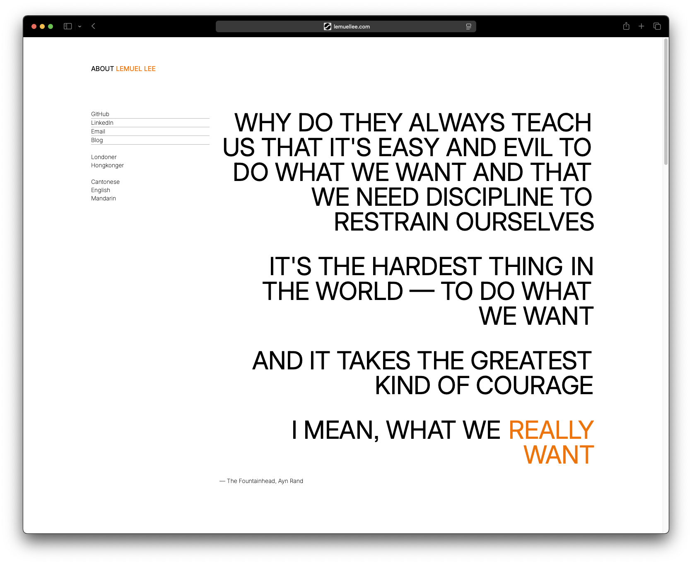
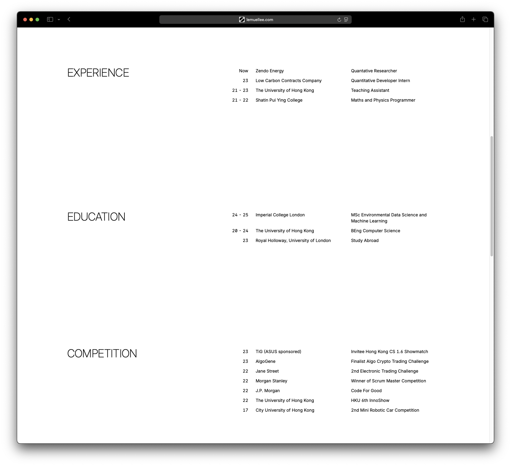

# lemuellee.com

This personal website uses the grid layout and follows a Swiss-like design philosophy. 

<!-- Images from the images folder -->

   
  

## License

This template is open-source software licensed under the [BSD 3-Clause "New" or "Revised" License](https://github.com/LemuelKL/lemuellee.com/blob/main/LICENSE). Feel free to fork, modify, and use it in your projects.
