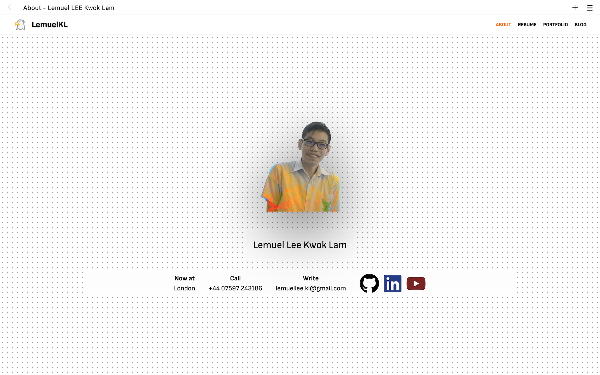

# Lemuel's Personal Website

[](https://app.netlify.com/sites/lemuellee/deploys)

Live at https://lemuellee.com

## Showcase



## Features

-   Extremely fast page load times.
-   Responsive design.
-   SEO friendly.
-   Consistent design across all pages.
-   Fully static site.
-   Custom content management system for blog posts and portfolio items.
-   MDsveX for markdown support in blog posts and portfolio items.
-   Automatic sitemap.xml generation.

## Developing

```bash
npm install
npm run dev -- --open
```

Tools and scripts used:

-   Prettier
-   ESLint
-   Opinionated ordering of TailwindCSS classes

## Building

```bash
npm run build
```
